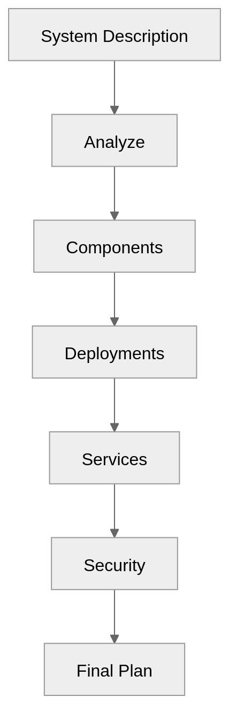

# Kubernetes Deployment Planner (Agent Skill)

## Purpose

Generate production-ready Kubernetes plans from system descriptions.

## Skill Flow

## Core Logic
```text
Identify components
Classify (stateless/stateful)
Assign Deployments/StatefulSets
Define Services
Add ConfigMaps & Secrets
Apply RBAC
Define communication
Add scaling
Add observability
Apply security
```

## components:
  - frontend
  - backend  
traffic: high  
security: strict

## Output Includes
```text
Namespaces
Deployments
Services
ConfigMaps
Secrets
RBAC
Scaling
Security
```

| Test Case     | Expected                |
| ------------- | ----------------------- |
| Microservices | Correct service mapping |
| AI system     | Agent handling          |
| Secure app    | Strong RBAC + secrets   |

## Advanced Features
```text
Suggest HPA automatically
Recommend secret rotation
Generate NetworkPolicies
Security scoring (optional extension)
```