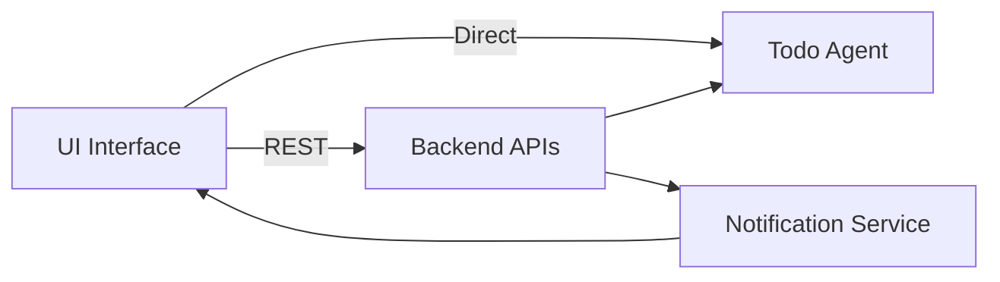
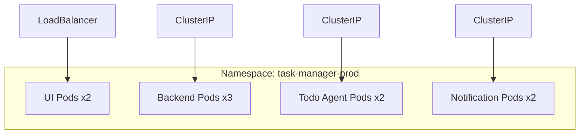

# plan-1-task-manager.md
AI Native Task Manager — Kubernetes Deployment Plan
🧩 Architecture Overview

```mermaid
flowchart LR
    UI[UI Interface] -->|REST| BE[Backend APIs]
    UI -->|Direct| AG[Todo Agent]
    BE --> AG
    BE --> NS[Notification Service]
    NS --> UI
```

## Kubernetes Architecture

```mermaid
flowchart TB
    subgraph Namespace: task-manager-prod
        UI_POD[UI Pods x2]
        BE_POD[Backend Pods x3]
        AG_POD[Todo Agent Pods x2]
        NS_POD[Notification Pods x2]
    end

    UI_SVC[LoadBalancer] --> UI_POD
    BE_SVC[ClusterIP] --> BE_POD
    AG_SVC[ClusterIP] --> AG_POD
    NS_SVC[ClusterIP] --> NS_POD
```

