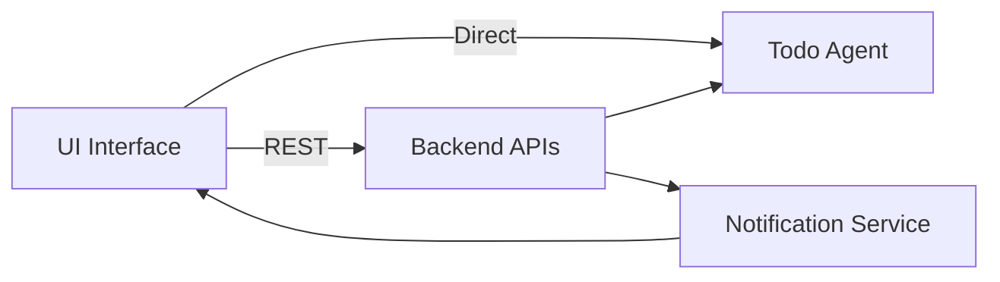
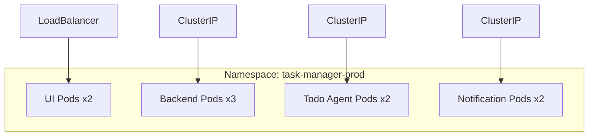
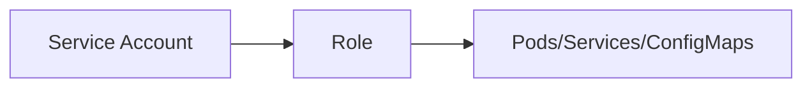
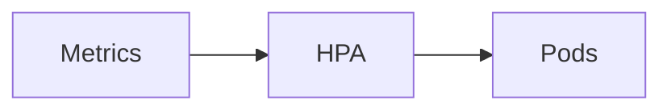

# plan-1-task-manager.md
AI Native Task Manager — Kubernetes Deployment Plan
🧩 Architecture Overview



## Kubernetes Architecture


## Deployments

| Component            | Type       | Replicas | Strategy      |
| -------------------- | ---------- | -------- | ------------- |
| UI                   | Deployment | 2        | Rolling       |
| Backend APIs         | Deployment | 3        | Rolling       |
| Todo Agent           | Deployment | 2        | Rolling       |
| Notification Service | Deployment | 2        | Rolling       |

## Services

| Service      | Type         | Exposure |
| ------------ | ------------ | -------- |
| UI           | LoadBalancer | Public   |
| Backend      | ClusterIP    | Internal |
| Todo Agent   | ClusterIP    | Internal |
| Notification | ClusterIP    | Internal |


## ConfigMaps
```yaml
ui-config:
  API_BASE_URL: /api

backend-config:
  DB_HOST: postgres
  FEATURE_FLAG: true

agent-config:
  MODEL: gpt
  TIMEOUT: 30

notification-config:
  QUEUE: redis
```

## Secrets
db-credentials  
api-keys  
notification-tokens  

## Best Practice

Use External Secrets Operator (Vault)  
Enable rotation

## RBAC



## 🔄 Inter-Service Communication

| Source  | Target       | Protocol    |
| ------- | ------------ | ----------- |
| UI      | Backend      | REST        |
| UI      | Agent        | HTTP        |
| Backend | Agent        | gRPC        |
| Backend | Notification | Queue/Event |

## Scaling



HPA enabled
CPU + Request-based scaling


## Observability
Logging: Fluentd
Monitoring: Prometheus
Dashboard: Grafana


## Security
TLS everywhere
NetworkPolicies (restrict pod communication)
Image scanning (CI/CD)