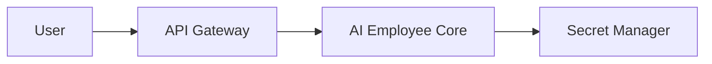
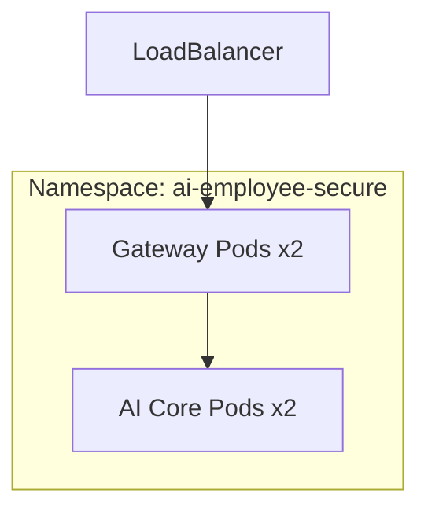
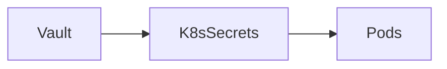
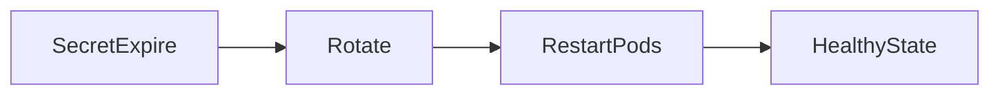
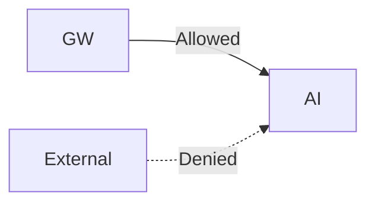

# AI Employee (OpenClaw) — Secure Kubernetes Plan

## Secure Architecture

## Kubernetes Layout

## 📦 Deployments

| Component   | Replicas | Notes   |
| ----------- | -------- | ------- |
| API Gateway | 2        | Public  |
| AI Core     | 2        | Private |

## Services
| Service | Type         |
| ------- | ------------ |
| Gateway | LoadBalancer |
| AI Core | ClusterIP    |

## 🔐 Secrets Management

## Strategy:

External Vault integration  
Short-lived tokens  
Auto rotation

##  Secret Expiry Handling

## 🔑 RBAC (Strict Isolation)

| Service | Access       |
| ------- | ------------ |
| Gateway | AI Core only |
| AI Core | Secrets only |

Principle: Least Privilege  

## 🌐 Network Security

NetworkPolicies enforced  
No direct public access to AI Core  

## Data Security
TLS (in transit)  
Encryption at rest (etcd)  
Token-based authentication

## Monitoring & Audit
Audit logs enabled  
Behavior anomaly detection  
Alerting system

